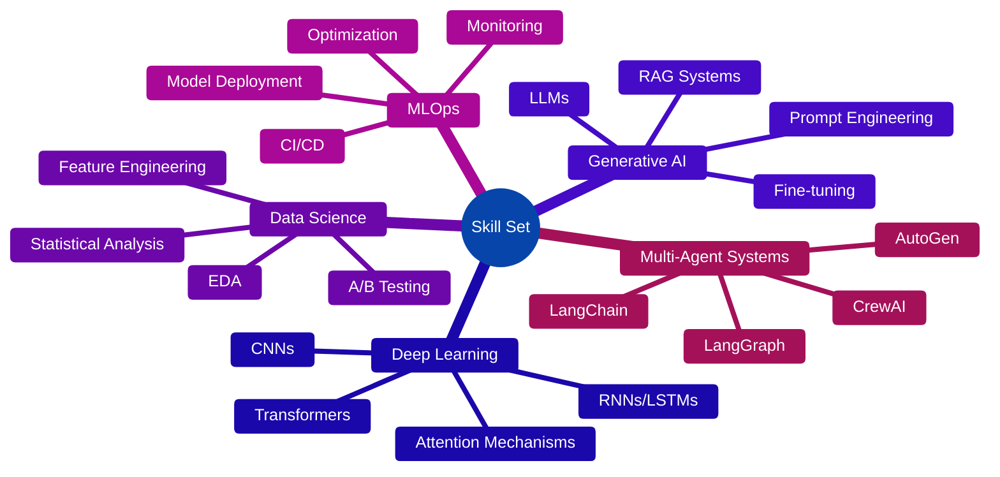

---

## 🚀 About Me

🎓 **Master's in Science and Technology from NIT Warangal** | 💼 **Data Scientist @ Analytics Vidhya**

I'm a **Data Scientist** specializing in **Generative AI** and **Multi-Agent Systems**. I build intelligent workflows using cutting-edge frameworks like **LangChain**, **LangGraph**, **CrewAI**, and **AutoGen**.

### 🎯 What I Do:
- 🤖 Build **Multi-Agent RAG Systems** and **LLM-based automation**
- ✍️ Technical blogger with **100K+ sessions** bridging ML fundamentals with GenAI
- 📊 Enhanced defect detection accuracy by **40%** using ML models
- 🎓 Simplified complex AI concepts for the developer community

### 🌱 Currently Exploring:
- Advanced **Agentic AI** architectures
- **Multi-Agent orchestration** patterns
- **RAG optimization** techniques
- **LLM fine-tuning** and deployment strategies

---

## 🛠️ Tech Stack & Tools

###  Programming Languages

    
    
    

### 🤖 AI & Machine Learning Frameworks

    
    
    
    
    
    

### 🧠 Generative AI & LLM Stack

    
    
    
    
    
    
    
    
    

### 🗄️ Vector Databases & Search

    
    
    
    
    

### 📊 Data Science & Visualization

    
    
    
    
    
    

### 🛠️ MLOps & Deployment

    
    
    
    
    
    
    

### 🔧 Development Tools & Version Control

    
    
    
    
    

### 💾 Databases & Cloud

    
    
    
    

### 🎯 Specialized Skills

---

## 📊 GitHub Statistics

  
  

  
  

  

---

## 🎯 Projects

### 🤖 Autograder - AI Evaluation System

  

Developed a robust framework to automatically evaluate the performance and compliance of RAG pipelines and agentic workflows. The system defines critical metrics for accuracy including Precision@k and F1-score, ensuring quality assessment of AI-powered solutions. This comprehensive evaluation framework provides actionable insights for optimizing RAG systems and multi-agent workflows.

**Tech Stack:** `Python` `NLP` `LLMs` `RAG Evaluation` `Metrics Framework` `Automation`

---

### 💬 Blog Website Chatbot - Intelligent Learning Assistant

  

Designed and implemented a dynamic blog chatbot that leverages both current and related blog content to answer user queries. Integrated an agent-based RAG system, allowing the chatbot to not only resolve queries but also generate personalized learning paths based on available resources. Users can further customize their learning roadmap within the same session, enhancing the personalization and interactivity of the platform.

**Tech Stack:** `LangChain` `Agent-based RAG` `Multi-Agent Systems` `Streamlit` `Vector DB` `Personalization Engine`

---

### 🎯 Query Resolution System - AI-Powered Support

  

Developed an AI-powered query resolution system that integrates RAG (Retrieval-Augmented Generation) and Agentic AI to boost response accuracy and efficiency by over 60%. The system orchestrates multi-agent workflows using CrewAI for streamlined agent coordination and LangChain for LLM-based retrieval, enabling precise and context-aware query handling across a variety of domains.

**Tech Stack:** `CrewAI` `LangChain` `RAG` `Agentic AI` `Multi-Agent Orchestration` `Context Management`

---

### 🏥 Smart Health Assistant - Personalized Wellness Platform

  

Built a Smart Health Assistant that gathers user-specific data to provide personalized health recommendations. Utilizing specialized AI agents, the assistant delivers tailored meal plans and creates customized workout schedules. The system provides a comprehensive, individualized health plan designed to optimize well-being, empowering users to track and improve their physical health efficiently.

**Tech Stack:** `Multi-Agent Systems` `Python` `AI/ML` `Data Processing` `Personalization` `LangChain` `AutoGen`

---

## 🎓 Education & Certifications

### 🏛️ Education
**Master's in Science and Technology** - Electronics Specialization | National Institute of Technology, Warangal  
**Bachelor of Science** | Pt. Neki Ram Sharma Govt. College

### 🏆 Certifications

---

<!-- ## 🏆 GitHub Trophies

  

--- -->
## 🌟 Areas of Interest

<table>
<tr>
<td align="center" width="20%">
 
<b>Generative AI</b> 
LLMs • RAG • Fine-tuning
</td>
<td align="center" width="20%">
 
<b>Multi-Agent Systems</b> 
LangChain • CrewAI • AutoGen
</td>
<td align="center" width="20%">
 
<b>Deep Learning</b> 
CNNs • Transformers • RNNs
</td>
<td align="center" width="20%">
 
<b>Data Science</b> 
ML • Analytics • Visualization
</td>
<td align="center" width="20%">
 
<b>Machine Learning</b> 
Supervised • Unsupervised • Ensemble
</td>
</tr>
<tr>
<td align="center" width="20%">
 
<b>NLP</b> 
Text Processing • Embeddings • Transformers
</td>
<td align="center" width="20%">
 
<b>RAG Architectures</b> 
Vector DBs • Semantic Search
</td>
<td align="center" width="20%">
 
<b>MLOps</b> 
Deployment • CI/CD • Monitoring
</td>
<td align="center" width="20%">
 
<b>Computer Vision</b> 
Object Detection • Classification
</td>
<td align="center" width="20%">
 
<b>AI Research</b> 
Innovation • Experimentation
</td>
</tr>
</table>

---

## 🤝 Let's Connect & Collaborate!

### 💬 I'm always interested in:
🔹 **Generative AI Projects** | 🔹 **Multi-Agent Systems** | 🔹 **RAG Applications** | 🔹 **Data Science** | 🔹 **Technical Collaborations**

### 📫 Reach Out:

### ✍️ Read My Blogs:

---

